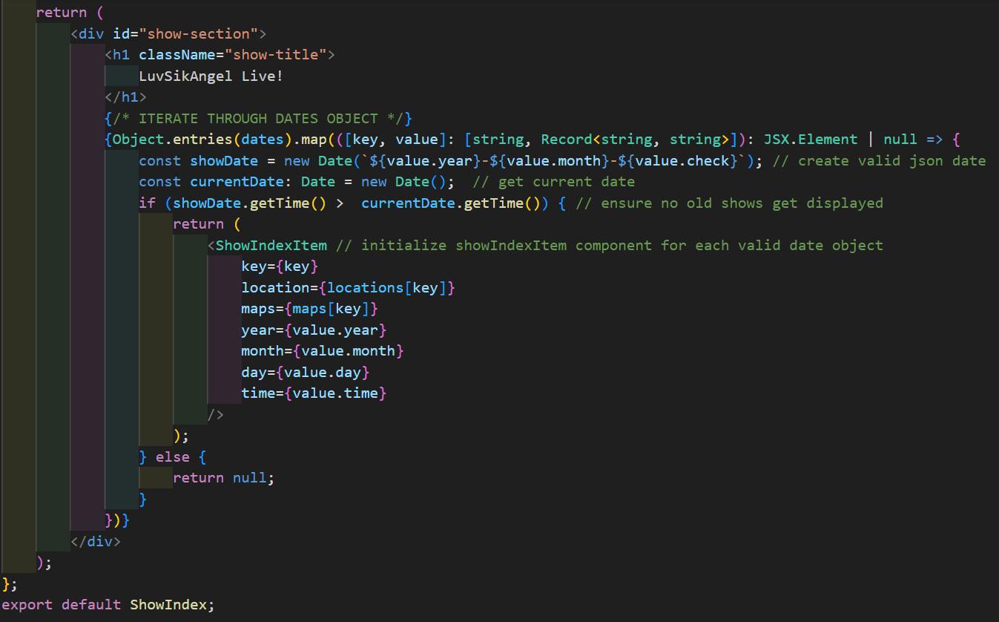

# Welcome To LuvSikAngel!

### [LuvSikAngel.com](https://luvsikangel.com), is a dynamic web application showcasing the latest updates and events for the band LuvSikAngel. Originally built using JavaScript, this project has undergone significant enhancements and refactoring, gradually incorporating TypeScript for improved type safety and maintainability. With each iteration, new features and optimizations have been introduced, reflecting a commitment to delivering an exceptional user experience and staying at the forefront of web development technologies. Dive in to explore the journey of LuvSikAngel, where music meets innovation.  

## Currently Under Construction!

### Nearing the final draft of [LuvSikAngel.com](https://luvsikangel.com). Check back soon to see the improvements!

# Tech Stack!

<code></code>
<code></code>
<code></code> 

<code></code>
<code></code>
<code></code>

### Backend built with Ruby on Rails coming soon!
<code></code>

#### Checkout the Github Repository [LuvSikRails](https://github.com/NickGentryBJJ/LuvSikRails)

#

# Upcoming Shows: Seamlessly Managed with React and TypeScript

   The ShowIndex component serves as the central hub for displaying upcoming shows in a React application. Leveraging TypeScript, it meticulously iterates through a dynamic list of show dates, ensuring type safety and robustness in code. Through this iteration process, it dynamically renders instances of the ShowIndexItem component, which handles the presentation of individual show details. This seamless collaboration between ShowIndex and ShowIndexItem components not only promotes code reusability and adherence to the DRY principle but also facilitates a clear and maintainable codebase. By employing TypeScript interfaces, the ShowIndexItem component enforces strict prop types, guaranteeing consistency and reliability in data handling. Together, these components form a cohesive and efficient solution for managing and displaying show information in a React application, exemplifying the power of React and TypeScript synergy in frontend development. 

## Code Snippet From ShowIndex

    

#
## Code Snippet From ShowIndexItem

    

#
## Mobile or Desktop Compatability!

    Thanks to its mobile-friendly styling and carefully adjusted layout, our application ensures an intuitive user experience and easy digestion of information, regardless of the device being used for scrolling.
    

#
  

    
  

  
#
## Deployment!

### Deployed and stored using Github!

<code></code>
<code></code>

#
## Developer

### [Nicholas Gentry](https://www.linkedin.com/in/nicholas-gentry-2721451b2/)

#### Find me Here!
  
    

